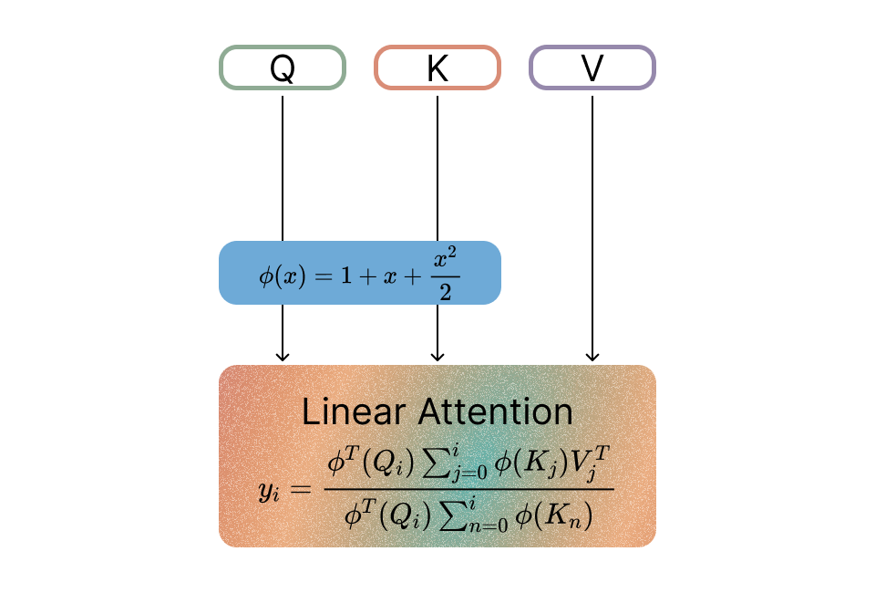

# Linear Transformers with Learnable Kernel Functions are Better In-Context Models

## About
The recent Based model emerged as a hybrid solution, blending a Linear Transformer with a kernel inspired by the Taylor expansion of exponential functions, augmented by convolutional networks. Mirroring the Transformer's in-context adeptness, it became a strong contender in the field. In our work, we present a singular, elegant alteration to the Based kernel, ReBased, that amplifies its in-context learning and overall language modeling process. This repository is a modification of the original [Zoology](https://github.com/HazyResearch/zoology) codebase. Also we provide Triton kernels for ReBased, built on [Flash Linear Attention repository](https://github.com/sustcsonglin/flash-linear-attention).

Based          |  ReBased
:-------------------------:|:-------------------------:
 | 

## Launching experiments

Ensure you have torch and all other dependencies listed in ```requirements.txt``` installed. Then install flash linear attention kernels:
```bash
pip install -r requirements.txt
cd flash_linear_attention && FLA_SKIP_CUDA_BUILD=TRUE pip install -e .
```

Fill missing Wandb key, entity and project ids in config files.
Now you can start with running one simple [MQAR experiment](configs/simple_mqar.yaml) on sequence length 48:
```bash
export WANDB_API_KEY="API_KEY"
python3 src/train.py --config_path configs/simple_mqar.yaml
```
 
Then, you can reproduce Figure 1 from our paper by running the [sweep](configs/main_fig_sweep.yaml). If you have multiple GPUs you can run ```wandb agent``` command several times:
```bash
wandb sweep configs/main_fig_sweep.yaml
wandb agent entity/project/id
```

When the sweep is finished run all the commands in the [Jupyter notebook](main_fig_parsing.ipynb) to obtain plot and get results for MQAR dataset for Based, Rebased, RWKV, Mamba, ConvAttention architectures, different model dimensions and sequence lengths:


## Citation
This repo was developed on top of Zoology and FLA Triton kernels. Cite them too:
```bib
@article{zoology2023,
  title={Zoology: Measuring and Improving Recall in Efficient Language Models},
  author={Arora, Simran and Eyuboglu, Sabri and Timalsina, Aman and Johnson, Isys and Poli, Michael and Zou, James and Rudra, Atri and Ré, Christopher},
  journal={	arXiv:2312.04927},
  year={2023}
}

@software{yang2024fla,
  title  = {FLA: A Triton-Based Library for Hardware-Efficient Implementations of Linear Attention Mechanism},
  author = {Yang, Songlin and Zhang, Yu},
  url    = {https://github.com/sustcsonglin/flash-linear-attention},
  month  = jan,
  year   = {2024}
}
```